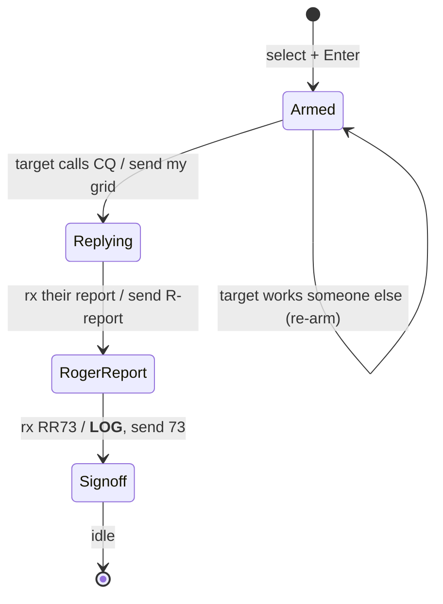
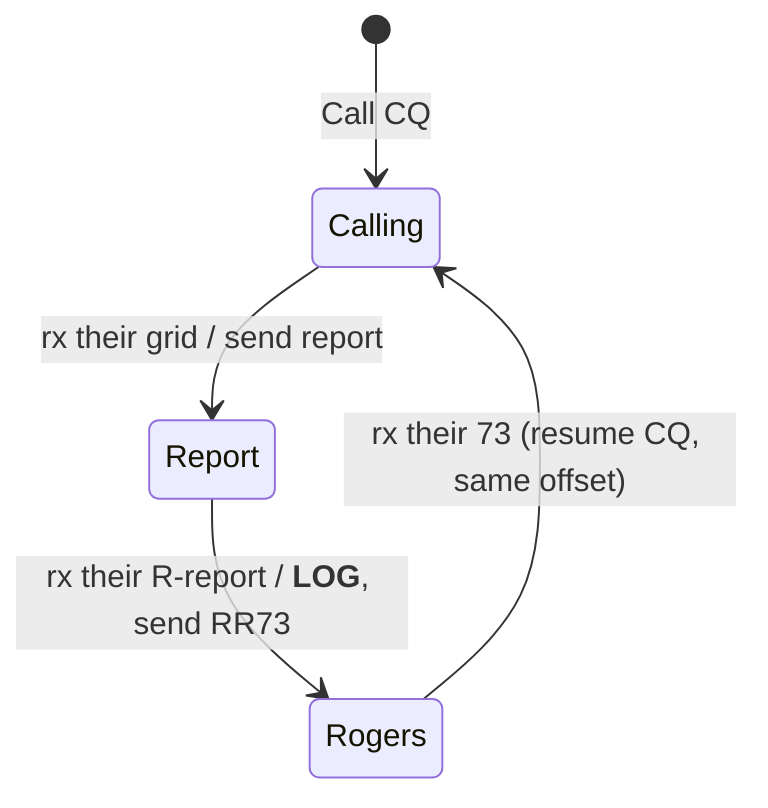

# QSOs, and the Progress State Machine

> **Personal working document — may be incomplete or out of date.** Do not treat
> anything in this folder as a source of truth. The canonical references are
> `docs/qso_flow.md`, `docs/wsjtx_qso_sequencing.md`, and the code in
> `crates/qso`. This file is a from-the-ground-up companion: what a QSO *is*, how
> you run one in DM420, the same thing drawn as a state machine, and a summary of
> the refactor we're about to do.

---

## Part 1 — What an FT8 QSO actually is (new-to-FT8 primer)

**FT8 is a weak-signal digital mode.** Your radio and computer trade short, fixed
messages on a precise 15-second clock (FT4 is 7.5 s). Each transmission is exactly
**12.6 seconds**, then everyone listens. Because the messages are tiny and
structured — about 13 characters, drawn from a fixed grammar — the software can dig
them out of noise far below what you could hear by ear, and it can **decode dozens
of stations in the same slot at once**. That last part is why FT8 fills a band: a
whole pileup of stations shares one 2–3 kHz audio window, each on its own little
audio tone, and the decoder reads them all.

**A QSO (a contact) is the smallest complete, confirmed exchange between two
stations.** To "count," both stations must exchange — and *confirm receipt of* —
three things:

1. **Both call signs** (who is talking to whom),
2. **A signal report** (how well each heard the other, in dB), and
3. **A roger** (each side acknowledging it got the other's report).

FT8 messages are **addressed and self-describing**: a message names the station
it's *to* first, then the station it's *from*, then the payload. `W9XYZ K1ABC FN42`
means "to W9XYZ, from K1ABC, my grid is FN42." That structure is what lets the
software follow a conversation it's only half-party to.

### The standard contact, step by step

Say **you are W9XYZ** in grid EM48 and you call CQ; **K1ABC** in FN42 answers.
Reading top to bottom is one full QSO (each line is one 15-second slot; the two
stations alternate slots):

```
  YOU  (W9XYZ)  →   CQ W9XYZ EM48        "calling anyone; I'm W9XYZ in EM48"
  THEM (K1ABC)  →   W9XYZ K1ABC FN42     "W9XYZ, this is K1ABC, grid FN42"
  YOU           →   K1ABC W9XYZ -12      "K1ABC, I copy you at -12 dB"
  THEM          →   K1ABC W9XYZ R-09     "Roger; you're -09 here"
  YOU           →   K1ABC W9XYZ RR73     "Roger roger, 73"   ← contact is complete
  THEM          →   K1ABC W9XYZ 73       "73"                ← courtesy sign-off
```

- The **report** (`-12`) is a signal-to-noise figure in dB — negative is normal.
- The leading **`R`** in `R-09` is the roger: "I received your report, and here's
  mine."
- **`RR73`** means "I have everything I need — roger, and 73 (best wishes)." It's
  the moment the contact is in the log. The final bare **`73`** is courtesy; the
  QSO already counted.

The **answering** station's path is the mirror image: hear a CQ → send your grid →
get a report → roger it with your own report → get `RR73` (log it) → send `73`.

### Field Day is a little different

In a contest like **ARRL Field Day**, you don't trade signal reports — you trade a
**contest exchange**: your **class** (number of transmitters + a letter, e.g.
`3A`) and your **ARRL/RAC section** (e.g. `CO` for Colorado). Two things change
from the normal flow:

1. The **grid step is skipped** — the answering station opens *directly* with the
   exchange (`W9XYZ K1ABC 2B IL`), no grid.
2. Because that step is gone, the **`RR73`/`73` roles swap**: in Field Day the
   *answering* station sends the `RR73`, and the station that called CQ sends the
   final `73`.

Everything else — the addressing, the clock, the "confirm both ways" requirement —
is the same. (Only stations sending a valid class + section are participating;
someone answering your `CQ FD` with a plain grid isn't in the contest, and working
them just stalls.)

---

## Part 2 — How you run a QSO in DM420

### What you're looking at: the waterslide

A normal waterfall shows frequency left-to-right and scrolls downward. DM420
**rotates it** into a *waterslide*: **frequency is vertical, time is horizontal**,
and — the whole point — **each signal's decoded text is printed in its own
horizontal lane**, right next to the signal that produced it. The FFT is on one
side, the decoded text on the other, and "now" is the center. You read the band as
a set of stacked conversations instead of a scrolling list, so it's easy to see who
is calling, who is in a QSO, and where there's an open lane.

### The only two things you do

In normal operation you ever do just one of two gestures, both on the waterslide:

1. **Call CQ.** Click an **empty** patch of spectrum (a clear lane) and press
   **Enter**. DM420 calls CQ on that audio offset and works whoever answers.
2. **Answer a station.** Click an existing **station** and press **Enter**. DM420
   *arms* to that station and answers it the **next time it calls CQ** — even if
   it's busy with someone else right now.

Everything after that — slot timing, picking the right next message, advancing the
exchange, and **logging** — is automatic. The text box at the bottom shows the
message that's queued to go out next.

### DM420's twist: arm and wait for CQ

This is the main departure from WSJT-X, which barges in and replies the instant you
double-click. DM420 instead **arms** to your target and stays **receive-only** until
that station calls CQ, then jumps in on the opposite slot. It's the polite,
good-operator behavior — you wait your turn — and it lets you line up a busy station
without transmitting over its current QSO.

- If your target **answers someone else** (you lost the race), DM420 **stops
  immediately** and **re-arms** to wait for its next CQ. It doesn't give up on its
  own.
- There's **no arm timeout** — you're sitting there, and **Enter is also the Stop**:
  pressing Enter again while armed or transmitting **disarms** and goes quiet. That
  single toggle is the whole abort story in v1.

### Resume — the one recovery gesture

If you armed to a station, it didn't answer, you disarmed to look elsewhere, and
*then* its answer to your earlier call finally shows up — arming again won't help
(that waits for a *CQ* it won't send). Instead, **click the line addressed to you**
(`W9XYZ K1ABC …`) and press Enter. DM420 **picks the contact up mid-stream**,
figures out which side of the exchange you're on from that line, and answers.

### Where you transmit: the outgoing (TX) offset

The waterslide tracks an **outgoing offset** — the audio tone your next
transmission uses. It usually does **not** retune the radio's dial; it just places
your audio. Clicking empty spectrum sets it to where you clicked; clicking a
station **snaps** it to that station's tone (zero-beat reply). The offset is **held
for the whole QSO** (it doesn't chase your partner), and after a CQ-started contact
finishes, DM420 **resumes CQ on the same offset**.

You can **lock** the offset (Tab / the LOCKED control). While locked, *nothing*
moves it — not a click, not the engine's own auto-QSY. The engine is the single
owner of that offset; the panel only asks it to move.

### Two postures: locked (operate) vs unlocked (configure)

The whole app has a global lock. **Locked = operate** (the edit knobs hide, you're
running QSOs). **Unlocked = configure** (radio settings, etc. are editable). Radio
settings you change while unlocked apply when you **re-lock**.

### Typing to the software: slash commands

The text box isn't for hand-writing FT8 messages (you don't — sequencing is
automatic). It's for **slash commands** to the software, e.g. `/f 14.074` to set
frequency or `/b 20` to change band. `:` may work as an alias for `/`.

### When several stations answer at once

DM420 auto-picks the **strongest** caller that **isn't a dupe** and **isn't already
being worked by another operator on your LAN**. All answerers are highlighted; you
can override with the **number keys** top-to-bottom (`1` = top caller). A manual
pick can override the dupe/peer exclusion.

### Field Day

Set Field Day mode and your class/section, and the flow above adapts automatically:
the CQ becomes `CQ FD …`, the exchange replaces the report, and the `RR73`/`73`
roles (and the moment of logging) follow the contest rules. DM420 only commits to
callers who send a **valid class + section**, so plain-grid non-participants don't
get half-worked.

---

## Part 3 — The same thing, as a finite state machine

Strip away the radio and the UI and a QSO is a small **finite state machine**: at
any moment you're in one state, an event arrives, and that event moves you to the
next state and (maybe) makes you transmit something or write a log entry. The
engine in `crates/qso` is exactly this — pure, synchronous, no I/O.

### The pieces of the machine

**Inputs (events):**
- **Operator commands** — *call CQ*, *arm to a target*, *resume*, *abort*.
- **Inbound decodes** — a received message, classified by **kind**: a CQ, a grid, a
  report, a roger-report, a Field-Day exchange (bare or rogered), or a sign-off
  (`RRR`/`RR73`/`73`).
- **Slot ticks** — the 15-second T/R boundary that decides whose turn it is to talk.

**Outputs (per event):**
- The **state to publish** (so the UI can render it),
- An optional **message to transmit** this slot, and
- An optional **completed contact to log**.

**The two roles.** Every in-progress contact is one of:
- **CallingCq** — *you* called CQ and they answered you, or
- **Answering** — *they* called CQ and you answered them.

The role fixes which messages you send and *when you log* (see below).

**The states (`Progress`)** mirror WSJT-X's `m_QSOProgress`. Before a contact:
`Idle`, `Armed` (DM420's wait-for-CQ), or `Calling`. During a contact the progress
walks through: **Replying → Report → RogerReport → Rogers → Signoff**, ending in a
log and a return to `Idle` (if answering) or back to `Calling` (if you were running
CQ).

### The driving principle: content-driven transitions

The machine does **not** advance on a blind internal step counter. It advances on
**what it just received**. If a correctly-addressed roger-report arrives, you move
to the `Rogers` stage and fire `RR73` — regardless of how you *thought* the
exchange was going. This is what makes the sequence robust to dropped slots and is
WSJT-X's interop rule: *re-derive state from received content.*

### The happy paths

**Answering a station (Standard):**



**Calling CQ (Standard):**



**Logging trigger** falls out of the role: the side that **sends** `RR73` logs *on
send*; the side that **receives** `RR73` logs *on receive*. **Field Day swaps which
role holds the `RR73` slot**, so it swaps the logging trigger too — but it's the
same rule, not a special case.

### The edges that aren't the happy path

- **Lost the race / abandon.** While answering (or mid-contact), if your partner
  starts addressing a *different* call, you stop and either re-arm (answering side)
  or resume CQ (CQ side). Good-citizen QRM avoidance.
- **Give-up timeout.** A contact repeats its current message every TX slot until
  received content advances it. If nothing advances it for a few overs
  (`overs_since_progress` hits a cap), the machine **gives up** rather than
  hammering forever — surfacing a one-shot `TimedOut`, then falling back to CQ or
  idle.
- **Resume.** Picking a contact up mid-stream **infers the role** from the clicked
  line (a grid-to-you means you were running CQ; a report-to-you means you were
  answering; Standard and Field Day reverse on a sign-off), then re-enters the same
  content-driven transitions.

### The transition, abstractly

Every sequencing decision in the machine is one function:

```
decide(role, contest, received-kind)  →  (reply, next-progress, log?, settle?)
```

…plus the **phase** you're in (entering a fresh contact vs. advancing a committed
one), which is what tells `(CallingCq, Standard, grid)` to *open* a contact when
you're calling CQ but to *ignore a repeat* when you're already mid-exchange. That
phase distinction is the subtle part — and it's the heart of the refactor below.

---

## Part 4 — The refactor we're about to do

### The problem

Today those sequencing decisions are **scattered across four functions** in
`crates/qso/src/engine.rs` (`commit_from_armed`, `commit_from_cq`, `advance_active`,
`resume_from`). Each is a hand-written match on (role, contest, message-kind) that
ends in a **silent `_ => None`** catch-all. The same content→action mapping is
duplicated four times, so a missing arm in one is invisible — which is exactly how
two real "never replies" bugs got in (a station answering with a report instead of
a grid, and a partner closing with a bare `73`, were both silently dropped).

### The goal

Consolidate the **decisions** (not the wiring) into typed, **exhaustive transition
tables**, so a forgotten or newly-added content case becomes a **compile error**
instead of a silently dropped QSO step. This is item 4 / task 3a in
`ARCHITECTURE_REVIEW.md`. It is **behavior-preserving**: the engine must sequence
every contact — both roles, Standard and Field Day — exactly as it does today.

### The shape

- A typed **`Progress`** enum (the states in Part 3) becomes the legible,
  published phase of a contact. Published `step` stays byte-identical for now;
  `Progress` is the authoritative label.
- **Two exhaustive tables**, not one: `open(...)` for entering a contact (the
  openers) and `advance(...)` for continuing one. Each matches **every** received
  message-kind by name — no `_` — so deliberate no-ops are explicit and new kinds
  break the build until classified. (Two tables, because the current advance logic
  is *progress-agnostic*; folding `Progress` into a single dispatch key would
  quietly change the give-up/timeout behavior. The phase — entering vs advancing —
  is the only real discriminator, and the engine already carries it in its state.)
- All four functions route their decision through those tables; the message-building
  and contact-construction stay where they are.
- Small related cleanup the review asks for: make the log-builder take the active
  contact directly, deleting an empty-callsign escape hatch.

### How we'll do it

**Test-first and green-gated**, one logical step per commit, mirroring the two
slices that just landed on this branch (the worked-status producer and the
TX-offset ownership work):

1. **Characterization tests first** — pin *today's* behavior across the whole
   matrix, especially the currently-silently-dropped cases, so "remove the
   catch-alls" is provably a no-op.
2. Then introduce `Progress` + the tables as inert vocabulary,
3. Then route each of the four sites through them, one commit at a time.

Green bar before every commit: `cargo build --workspace`,
`cargo clippy --all-targets -- -D warnings`, `cargo test`.

### Scope guardrails

**Not touched:** keying/PTT, slot timing, the TX path, the just-landed auto-QSY /
TX-offset / lock ownership, the worked-status producer, and the lost-race/abandon
semantics. Known quirks (e.g. the report-opener role asymmetry) are **preserved,
not fixed** — those are separate roadmap items, not this slice.

### How we'll know it worked

The characterization suite staying green across the routing commits is the
behavior-preservation proof. The final gate is **on-air**: run real QSOs through
the full sequence (CQ → report → RR73 → 73), including a Field Day class+section
exchange, on both roles, and confirm the progression is identical to before.
