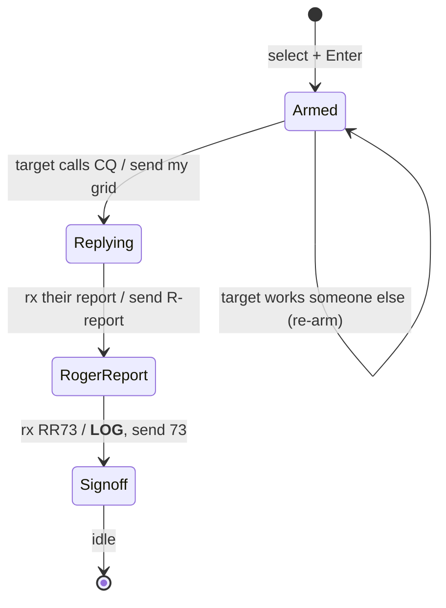
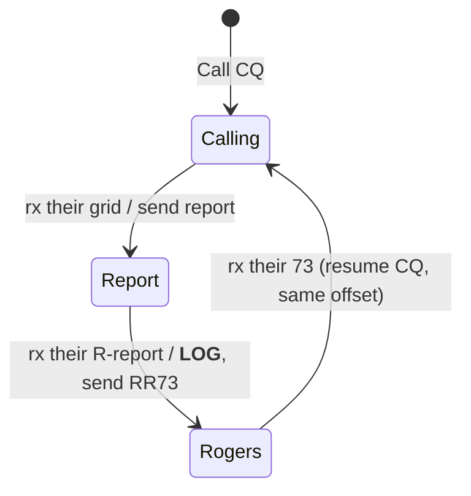

# QSOs, and the Progress State Machine

> **Personal working document — may be incomplete or out of date.** Do not treat
> anything in this folder as a source of truth. The canonical references are
> `docs/qso_flow.md`, `docs/wsjtx_qso_sequencing.md`, and the code in
> `crates/qso`. This file is a from-the-ground-up companion: what a QSO *is*, how
> you run one in DM420, the same thing drawn as a state machine, and a summary of
> the refactor (now landed).

---

## Part 1 — What an FT8 QSO actually is (new-to-FT8 primer)

**FT8 is a weak-signal digital mode.** Your radio and computer trade short, fixed
messages on a precise 15-second clock (FT4 is 7.5 s). Each transmission is exactly
**12.6 seconds**, then everyone listens. Because the messages are tiny and
structured — about 13 characters, drawn from a fixed grammar — the software can dig
them out of noise far below what you could hear by ear, and it can **decode dozens
of stations in the same slot at once**. That last part is why FT8 fills a band: a
whole pileup of stations shares one 2–3 kHz audio window, each on its own little
audio tone, and the decoder reads them all.

**A QSO (a contact) is the smallest complete, confirmed exchange between two
stations.** To "count," both stations must exchange — and *confirm receipt of* —
three things:

1. **Both call signs** (who is talking to whom),
2. **A signal report** (how well each heard the other, in dB), and
3. **A roger** (each side acknowledging it got the other's report).

FT8 messages are **addressed and self-describing**: a message names the station
it's *to* first, then the station it's *from*, then the payload. `W9XYZ K1ABC FN42`
means "to W9XYZ, from K1ABC, my grid is FN42." That structure is what lets the
software follow a conversation it's only half-party to.

### The standard contact, step by step

Say **you are W9XYZ** in grid EM48 and you call CQ; **K1ABC** in FN42 answers.
Reading top to bottom is one full QSO (each line is one 15-second slot; the two
stations alternate slots):

```
  YOU  (W9XYZ)  →   CQ W9XYZ EM48        "calling anyone; I'm W9XYZ in EM48"
  THEM (K1ABC)  →   W9XYZ K1ABC FN42     "W9XYZ, this is K1ABC, grid FN42"
  YOU           →   K1ABC W9XYZ -12      "K1ABC, I copy you at -12 dB"
  THEM          →   K1ABC W9XYZ R-09     "Roger; you're -09 here"
  YOU           →   K1ABC W9XYZ RR73     "Roger roger, 73"   ← contact is complete
  THEM          →   K1ABC W9XYZ 73       "73"                ← courtesy sign-off
```

- The **report** (`-12`) is a signal-to-noise figure in dB — negative is normal.
- The leading **`R`** in `R-09` is the roger: "I received your report, and here's
  mine."
- **`RR73`** means "I have everything I need — roger, and 73 (best wishes)." It's
  the moment the contact is in the log. The final bare **`73`** is courtesy; the
  QSO already counted.

The **answering** station's path is the mirror image: hear a CQ → send your grid →
get a report → roger it with your own report → get `RR73` (log it) → send `73`.

### Field Day is a little different

In a contest like **ARRL Field Day**, you don't trade signal reports — you trade a
**contest exchange**: your **class** (number of transmitters + a letter, e.g.
`3A`) and your **ARRL/RAC section** (e.g. `CO` for Colorado). Two things change
from the normal flow:

1. The **grid step is skipped** — the answering station opens *directly* with the
   exchange (`W9XYZ K1ABC 2B IL`), no grid.
2. Because that step is gone, the **`RR73`/`73` roles swap**: in Field Day the
   *answering* station sends the `RR73`, and the station that called CQ sends the
   final `73`.

Everything else — the addressing, the clock, the "confirm both ways" requirement —
is the same. (Only stations sending a valid class + section are participating;
someone answering your `CQ FD` with a plain grid isn't in the contest, and working
them just stalls.)

---

## Part 2 — How you run a QSO in DM420

### What you're looking at: the waterslide

A normal waterfall shows frequency left-to-right and scrolls downward. DM420
**rotates it** into a *waterslide*: **frequency is vertical, time is horizontal**,
and — the whole point — **each signal's decoded text is printed in its own
horizontal lane**, right next to the signal that produced it. The FFT is on one
side, the decoded text on the other, and "now" is the center. You read the band as
a set of stacked conversations instead of a scrolling list, so it's easy to see who
is calling, who is in a QSO, and where there's an open lane.

### The only two things you do

In normal operation you ever do just one of two gestures, both on the waterslide:

1. **Call CQ.** Click an **empty** patch of spectrum (a clear lane) and press
   **Enter**. DM420 calls CQ on that audio offset and works whoever answers.
2. **Answer a station.** Click an existing **station** and press **Enter**. DM420
   *arms* to that station and answers it the **next time it calls CQ** — even if
   it's busy with someone else right now.

Everything after that — slot timing, picking the right next message, advancing the
exchange, and **logging** — is automatic. The text box at the bottom shows the
message that's queued to go out next.

### DM420's twist: arm and wait for CQ

This is the main departure from WSJT-X, which barges in and replies the instant you
double-click. DM420 instead **arms** to your target and stays **receive-only** until
that station calls CQ, then jumps in on the opposite slot. It's the polite,
good-operator behavior — you wait your turn — and it lets you line up a busy station
without transmitting over its current QSO.

- If your target **answers someone else** (you lost the race), DM420 **stops
  immediately** and **re-arms** to wait for its next CQ. It doesn't give up on its
  own.
- There's **no arm timeout** — you're sitting there, and **Enter is also the Stop**:
  pressing Enter again while armed or transmitting **disarms** and goes quiet. That
  single toggle is the whole abort story in v1.

### Resume — the one recovery gesture

If you armed to a station, it didn't answer, you disarmed to look elsewhere, and
*then* its answer to your earlier call finally shows up — arming again won't help
(that waits for a *CQ* it won't send). Instead, **click the line addressed to you**
(`W9XYZ K1ABC …`) and press Enter. DM420 **picks the contact up mid-stream**,
figures out which side of the exchange you're on from that line, and answers.

### Where you transmit: the outgoing (TX) offset

The waterslide tracks an **outgoing offset** — the audio tone your next
transmission uses. It usually does **not** retune the radio's dial; it just places
your audio. Clicking empty spectrum sets it to where you clicked; clicking a
station **snaps** it to that station's tone (zero-beat reply). The offset is **held
for the whole QSO** (it doesn't chase your partner), and after a CQ-started contact
finishes, DM420 **resumes CQ on the same offset**.

You can **lock** the offset (Tab / the LOCKED control). While locked, *nothing*
moves it — not a click, not the engine's own auto-QSY. The engine is the single
owner of that offset; the panel only asks it to move.

### Two postures: locked (operate) vs unlocked (configure)

The whole app has a global lock. **Locked = operate** (the edit knobs hide, you're
running QSOs). **Unlocked = configure** (radio settings, etc. are editable). Radio
settings you change while unlocked apply when you **re-lock**.

### Typing to the software: slash commands

The text box isn't for hand-writing FT8 messages (you don't — sequencing is
automatic). It's for **slash commands** to the software, e.g. `/f 14.074` to set
frequency or `/b 20` to change band. `:` may work as an alias for `/`.

### When several stations answer at once

DM420 auto-picks the **strongest** caller that **isn't a dupe** and **isn't already
being worked by another operator on your LAN**. All answerers are highlighted; you
can override with the **number keys** top-to-bottom (`1` = top caller). A manual
pick can override the dupe/peer exclusion.

### Field Day

Set Field Day mode and your class/section, and the flow above adapts automatically:
the CQ becomes `CQ FD …`, the exchange replaces the report, and the `RR73`/`73`
roles (and the moment of logging) follow the contest rules. DM420 only commits to
callers who send a **valid class + section**, so plain-grid non-participants don't
get half-worked.

---

## Part 3 — The same thing, as a finite state machine

Strip away the radio and the UI and a QSO is a small **finite state machine**: at
any moment you're in one state, an event arrives, and that event moves you to the
next state and (maybe) makes you transmit something or write a log entry. The
engine in `crates/qso` is exactly this — pure, synchronous, no I/O.

### The pieces of the machine

**Inputs (events):**
- **Operator commands** — *call CQ*, *arm to a target*, *resume*, *abort*.
- **Inbound decodes** — a received message, classified by **kind**: a CQ, a grid, a
  report, a roger-report, a Field-Day exchange (bare or rogered), or a sign-off
  (`RRR`/`RR73`/`73`).
- **Slot ticks** — the 15-second T/R boundary that decides whose turn it is to talk.

**Outputs (per event):**
- The **state to publish** (so the UI can render it),
- An optional **message to transmit** this slot, and
- An optional **completed contact to log**.

**The two roles.** Every in-progress contact is one of:
- **CallingCq** — *you* called CQ and they answered you, or
- **Answering** — *they* called CQ and you answered them.

The role fixes which messages you send and *when you log* (see below).

**The states (`Progress`)** mirror WSJT-X's `m_QSOProgress`. Before a contact:
`Idle`, `Armed` (DM420's wait-for-CQ), or `Calling`. During a contact the progress
walks through: **Replying → Report → RogerReport → Rogers → Signoff**, ending in a
log and a return to `Idle` (if answering) or back to `Calling` (if you were running
CQ).

### The driving principle: content-driven transitions

The machine does **not** advance on a blind internal step counter. It advances on
**what it just received**. If a correctly-addressed roger-report arrives, you move
to the `Rogers` stage and fire `RR73` — regardless of how you *thought* the
exchange was going. This is what makes the sequence robust to dropped slots and is
WSJT-X's interop rule: *re-derive state from received content.*

### The happy paths

**Answering a station (Standard):**



**Calling CQ (Standard):**



**Logging trigger** falls out of the role: the side that **sends** `RR73` logs *on
send*; the side that **receives** `RR73` logs *on receive*. **Field Day swaps which
role holds the `RR73` slot**, so it swaps the logging trigger too — but it's the
same rule, not a special case.

### The edges that aren't the happy path

- **Lost the race / abandon.** While answering (or mid-contact), if your partner
  starts addressing a *different* call, you stop and either re-arm (answering side)
  or resume CQ (CQ side). Good-citizen QRM avoidance.
- **Give-up timeout.** A contact repeats its current message every TX slot until
  received content advances it. If nothing advances it for a few overs
  (`overs_since_progress` hits a cap), the machine **gives up** rather than
  hammering forever — surfacing a one-shot `TimedOut`, then falling back to CQ or
  idle.
- **Resume.** Picking a contact up mid-stream **infers the role** from the clicked
  line (a grid-to-you means you were running CQ; a report-to-you means you were
  answering; Standard and Field Day reverse on a sign-off), then re-enters the same
  content-driven transitions.

### The transition, abstractly

Every sequencing decision in the machine is one function:

```
decide(role, contest, received-kind)  →  (reply, next-progress, log?, settle?)
```

…plus the **phase** you're in (entering a fresh contact vs. advancing a committed
one), which is what tells `(CallingCq, Standard, grid)` to *open* a contact when
you're calling CQ but to *ignore a repeat* when you're already mid-exchange. That
phase distinction is the subtle part — and it's the heart of the refactor below.

### As a classic transition table (state · trigger · next state · effects)

If you picture the FSM the textbook way — a graph of states, keyed by **current
state → trigger → next state**, with the **outputs/side-effects** of each edge —
here is the *same machine* drawn that way. (Remember from above: the fine state
isn't actually stored; this is the conceptual graph. The implementation-shaped
Tables A–E further down carry the identical edges, just keyed by phase+content
instead of by the state column.) Each state has a **color chip** so you can trace
an edge by matching the chip in *Current state* to the one in *New state*.

**States:** ⬜ Idle · 🟦 Calling CQ · 🟪 Armed · 🟩 Replying · 🟨 Report ·
🟧 RogerReport · 🟥 Rogers · ⬛ Signoff.
**Effects:** 📤 transmit (with WSJT-X `Tx` slot) · 📝 write the log · 💾 save a
fact for the log · ↳ follow-on transition after our *own* TX.

| Current state | Trigger — `role · contest · event` | → New state | Effects (outputs / side-effects) |
|---|---|---|---|
| ⬜ **Idle** | op: **Call CQ** | 🟦 Calling | begin calling CQ |
| ⬜ **Idle** | op: **Arm** to a target | 🟪 Armed | go receive-only; publish "working this one" |
| ⬜ **Idle** | op: **Resume** a line to us | 🟩/🟨/🟧 *(rebuilt)* | reconstruct a contact from that line (Table E) · 📤 the implied reply |
| 🟦 **Calling** | tick · our slot · no answer | 🟦 Calling | 📤 `CQ …`; auto-QSY after 3 unanswered (if on) |
| 🟦 **Calling** | `CallingCq · Std` · rx **grid** → us | 🟨 Report | 📤 report `Tx2` · 💾 their grid |
| 🟦 **Calling** | `CallingCq · Std` · rx **report** → us (P3) | 🟧 RogerReport | 📤 roger+report `Tx3` · 💾 their report |
| 🟦 **Calling** | `CallingCq · FD` · rx **exchange** → us | 🟧 RogerReport | 📤 roger+exchange `Tx3` · 💾 their class+section |
| 🟦 **Calling** | op: **Abort** | ⬜ Idle | stop |
| 🟦 **Calling** | any other inbound | 🟦 Calling | ignored — keep calling CQ |
| 🟪 **Armed** | **target calls CQ** | 🟩 Replying | 📤 opener (grid `Tx1` Std / exchange `Tx2` FD) · 💾 target's grid |
| 🟪 **Armed** | target works **someone else** | 🟪 Armed | stay armed; wait for its next CQ |
| 🟪 **Armed** | op: **Abort** | ⬜ Idle | stop |
| 🟩 **Replying** | `Answering · Std` · rx **report** → us | 🟧 RogerReport | 📤 roger+report `Tx3` · 💾 their report |
| 🟩 **Replying** | `Answering · FD` · rx **R-exchange** → us | 🟥 Rogers | 📤 `RR73` `Tx4` · 📝 **on send** · 💾 their class+section · ↳ ⬜ Idle once it sends |
| 🟨 **Report** | `CallingCq · Std` · rx **R-report** → us | 🟥 Rogers | 📤 `RR73` `Tx4` · 📝 **on send** · await their 73 |
| 🟧 **RogerReport** / 🟥 **Rogers** | rx **sign-off** (RRR/RR73/73) → us | ⬛ Signoff ↳ ⬜ Idle *(answering)* / 🟦 Calling *(CQ side)* | 📝 **on receive** (if not yet logged) · 📤 courtesy `73` `Tx5` when we hold the slot (answering, or FD CQ side on RR73); Std CQ side already logged-on-send → no 73 |
| 🟩🟨🟧🟥 **any in-contact** | partner addresses **someone else** | 🟪 Armed *(answering)* / 🟦 Calling *(CQ side)* | abandon — lost race |
| 🟩🟨🟧🟥 **any in-contact** | **no progress** for N overs (tick) | 🟦 Calling / ⬜ Idle | one-shot `TimedOut`, then fall back |
| 🟩🟨🟧🟥 **any in-contact** | repeated / contest-mismatched / non-partner msg | *(unchanged)* | ignored — re-📤 current msg; give-up counter climbs |
| 🟩🟨🟧🟥 **any in-contact** | op: **Abort** | ⬜ Idle | stop |

> Two things to notice, both tying back to *why the code doesn't key on this
> state column*: (1) the very same `(role, contest, received-kind)` key from
> Tables A–E is here too — it's just folded into the **Trigger** column; and
> (2) `🟧 RogerReport` is reached from **three** different lanes (answering-Std,
> CQ-FD, CQ-Std-P3) and `🟥 Rogers` from two — that redundancy down the state
> column is exactly what collapses away when you key on phase+content instead.

---

## Part 4 — The refactor (the plan, now landed)

> ✅ **Landed** on branch `fd-progress-fsm` — test-first, green-gated, one commit per
> step. All four decision sites now route through the `open` / `advance` tables and
> every `_ => None` content catch-all is gone, so a missing or new content case is a
> compile error, not a silent dropped step. Behavior was preserved exactly: the
> characterization suite stayed green *unchanged* across every routing commit. The
> text below is the plan as written; the authoritative code is
> `crates/qso/src/engine.rs`.

### The problem

Today those sequencing decisions are **scattered across four functions** in
`crates/qso/src/engine.rs` (`commit_from_armed`, `commit_from_cq`, `advance_active`,
`resume_from`). Each is a hand-written match on (role, contest, message-kind) that
ends in a **silent `_ => None`** catch-all. The same content→action mapping is
duplicated four times, so a missing arm in one is invisible — which is exactly how
two real "never replies" bugs got in (a station answering with a report instead of
a grid, and a partner closing with a bare `73`, were both silently dropped).

### The goal

Consolidate the **decisions** (not the wiring) into typed, **exhaustive transition
tables**, so a forgotten or newly-added content case becomes a **compile error**
instead of a silently dropped QSO step. This is item 4 / task 3a in
`ARCHITECTURE_REVIEW.md`. It is **behavior-preserving**: the engine must sequence
every contact — both roles, Standard and Field Day — exactly as it does today.

### The shape

- A typed **`Progress`** enum (the states in Part 3) is the legible phase a contact
  carries (`Active.progress`), set by the appliers. The **published** phase stays
  `step` (byte-identical); `Progress` is the authoritative *internal* label, to be
  surfaced on the bus in a follow-up.
- **Two exhaustive tables**, not one: `open(...)` for entering a contact (the
  openers) and `advance(...)` for continuing one. Each matches **every** received
  message-kind by name — no `_` — so deliberate no-ops are explicit and new kinds
  break the build until classified. (Two tables, because the current advance logic
  is *progress-agnostic*; folding `Progress` into a single dispatch key would
  quietly change the give-up/timeout behavior. The phase — entering vs advancing —
  is the only real discriminator, and the engine already carries it in its state.)
- All four functions route their decision through those tables; the message-building
  and contact-construction stay where they are.
- Small related cleanup the review asks for: make the log-builder take the active
  contact directly, deleting an empty-callsign escape hatch.

### How we'll do it

**Test-first and green-gated**, one logical step per commit, mirroring the two
slices that just landed on this branch (the worked-status producer and the
TX-offset ownership work):

1. **Characterization tests first** — pin *today's* behavior across the whole
   matrix, especially the currently-silently-dropped cases, so "remove the
   catch-alls" is provably a no-op.
2. Then introduce `Progress` + the tables as inert vocabulary,
3. Then route each of the four sites through them, one commit at a time.

Green bar before every commit: `cargo build --workspace`,
`cargo clippy --all-targets -- -D warnings`, `cargo test`.

### Scope guardrails

**Not touched:** keying/PTT, slot timing, the TX path, the just-landed auto-QSY /
TX-offset / lock ownership, the worked-status producer, and the lost-race/abandon
semantics. Known quirks (e.g. the report-opener role asymmetry) are **preserved,
not fixed** — those are separate roadmap items, not this slice.

### How we'll know it worked

The characterization suite staying green across the routing commits is the
behavior-preservation proof. The final gate is **on-air**: run real QSOs through
the full sequence (CQ → report → RR73 → 73), including a Field Day class+section
exchange, on both roles, and confirm the progression is identical to before.

---

## The transition tables (tabular)

The readable twin of the code in the appendix below — the same decisions the engine's
`open` / `advance` tables make. **Keep these and the code in sync.** Legend: *Reply* names the message we queue (with its WSJT-X `Tx`
slot); *Progress* is the descriptive label set on the contact; *step* is the
display-only number published in `QsoState`; *Log* is when the contact is written
(`on send` = when the queued message transmits; `on receive` = immediately);
*Settle* is what happens after (`stay`, `finish → Idle/ResumeCq` after the message
goes out, or `resume CQ now`). Addressing (`to`/`from`/`caller`) is checked by the
routing sites *before* these tables, so it doesn't appear as a column.

### Table A — openers: a station answered our CQ → we become `CallingCq`

Shared by `commit_from_cq` and `resume_from`'s opener path. All openers `Log: —`
and `Settle: stay`.

| Contest | Received | Reply (we send) | Progress | step | Capture |
|---|---|---|---|---|---|
| Standard | `Grid(g)` | report — `Tx2` | `Report` | 1 | their grid |
| Standard | `Report(r)` *(P3 skip-Tx1)* | roger+report — `Tx3` | `RogerReport` | 2 | their report |
| Field Day | `FdBare{class,sec}` | roger+exchange — `Tx3` (`R 3A WI`) | `RogerReport` | 1 | their class+section |
| *either* | any other kind — wrong-contest opener, `RogerReport`, `FdRoger`, `Signoff`, `Cq`, free/raw | **— ignore → stay `Calling`** | | | |

### Table B — armed answer: our target called CQ → we become `Answering`

`commit_from_armed`, after checking `caller == target`. All `Log: —`, `Settle: stay`.

| Contest | Trigger | Reply (we send) | Progress | step | Capture |
|---|---|---|---|---|---|
| Standard | target's `Cq` | grid — `Tx1` (`answer_grid`) | `Replying` | 1 | target's grid |
| Field Day | target's `Cq FD` | exchange — `Tx2` (`fd_exchange`, no grid) | `Replying` | 1 | target's grid |
| *either* | target answers **someone else** | **— stay `Armed`** (receive-only) | | | |

### Table C — advance a committed contact

`advance_active`, after the addressing / lost-race (`abandon`) pre-check — so every
row here is a directed message from our partner.

| Role | Contest | Received | Reply (we send) | Progress | step | Capture | Log | Settle |
|---|---|---|---|---|---|---|---|---|
| Answering | Standard | `Report(r)` | roger+report — `Tx3` | `RogerReport` | 2 | their report | — | stay |
| Answering | Field Day | `FdRoger{…}` | `RR73` — `Tx4` | `Rogers` | 2 | their class+section | **on send** | finish → Idle |
| CallingCq | Standard | `RogerReport(r)` | `RR73` — `Tx4` | `Rogers` | 2 | their report | **on send** | stay |
| *any* | *any* | `Signoff(k)` | *see Table D* | `Signoff` | 3 | — | **on receive** | *see Table D* |
| *any* | *any* | any other kind | **— ignore**: repeat current message; the give-up counter climbs → eventually time out | | | | | |

### Table D — sign-off: any directed `RRR`/`RR73`/`73` from our partner (P2)

`signoff_outcome`. Logs **on receive** if not already logged. `courtesy = role is
Answering, OR (Field Day AND the sign-off is a roger RR73/RRR)`.

| Side we're on | Sign-off | Courtesy reply | Settle |
|---|---|---|---|
| Answering (Standard or Field Day) | any (`RRR`/`RR73`/`73`) | `73` — `Tx5` | finish → Idle |
| CallingCq, Field Day | `RR73` / `RRR` (a roger) | `73` — `Tx5` | finish → ResumeCq |
| CallingCq, Field Day | bare `73` (non-roger) | — | resume CQ now |
| CallingCq, Standard | any (already logged on RR73-sent) | — | resume CQ now |

### Table E — resume role-inference

`resume_from` first infers which side we're on from the clicked line (Standard and
Field Day reverse the side that holds `RR73`), then routes into Table A or C.

| Contest | Clicked line | Inferred role | Routed to |
|---|---|---|---|
| Standard | `Grid` | CallingCq | Table A (opener) |
| Standard | `RogerReport` | CallingCq | Table C |
| Standard | `Report` | Answering | Table C |
| Standard | `RR73` / `RRR` | Answering | Table C/D (completes) |
| Field Day | `FdBare` | CallingCq | Table A (opener) |
| Field Day | `FdRoger` | Answering | Table C |
| Field Day | `RR73` / `RRR` | CallingCq | Table C/D (completes) |
| *either* | bare `73`, contest-mismatched opener, `Cq`, free/raw | — | **not resumable — ignored** |

> **Note the known asymmetry** (Tables A vs E): a bare `Report` addressed to us is
> read as **CallingCq** when it arrives while we're calling CQ (Table A, the P3
> opener) but as **Answering** when the operator *resumes* from it (Table E). The
> endings differ — CQ side resumes CQ with no final `73`; answering side sends `73`
> and goes idle. This is **preserved as-is** by the refactor (pinned by the
> `report_to_us_diverges_entry_vs_resume` test); unifying it is a separate question.

---

## Appendix — the code: `Progress` and the transition tables

> **Landed — `crates/qso/src/engine.rs` is authoritative.** This sketch matches the
> code as built, with two naming differences worth knowing: the advance-result enum is
> **`Transition`** (not `Step` — the engine already has a public `Step` output struct),
> and the resume role-inference stayed **inline in `resume_from`** rather than the
> standalone `resume_role` shown below (openers there are gated via `open()`). The
> `Progress` *labels* are descriptive (**Joel owns the final taxonomy**); the
> behavior-bearing fields are each transition's `reply`, `step`, `capture`, `log`, and
> `settle`. Prefer the code if this drifts.

### The state label, and the table key/value types

```rust
/// Where we are in the exchange — WSJT-X's `m_QSOProgress`, mirrored. The
/// authoritative, legible phase of a contact; the published `step` stays
/// display-only. `Calling` is the pre-contact `State::Calling`; a committed
/// `Active` carries one of `Replying`/`Report`/`RogerReport`/`Rogers`/`Signoff`.
#[derive(Clone, Copy, Debug, PartialEq, Eq)]
enum Progress { Calling, Replying, Report, RogerReport, Rogers, Signoff }

/// The received content the sequencer reacts to — a flattened projection of
/// `ParsedMessage` + `ExchangePayload`, with the Field Day exchange split by its
/// `rogered` bit (the two cases the engine treats differently). Addressing
/// (`to`/`from`/`caller`) is intentionally dropped: the routing sites check it
/// *before* consulting the tables.
enum MsgKind {
    Cq { grid: Option<GridSquare> },
    Grid(GridSquare),
    Report(i8),
    RogerReport(i8),
    FdBare { class: String, section: Section },   // FieldDay { rogered: false }
    FdRoger { class: String, section: Section },  // FieldDay { rogered: true }
    Signoff(Signoff),
    /// Free / Raw / anything the decoder couldn't classify — never sequenced.
    Other,
}

impl MsgKind {
    fn classify(m: &ParsedMessage) -> MsgKind {
        match m {
            ParsedMessage::Cq { grid, .. } => MsgKind::Cq { grid: grid.clone() },
            ParsedMessage::Exchange { payload, .. } => match payload {
                ExchangePayload::Grid(g) => MsgKind::Grid(g.clone()),
                ExchangePayload::Report(r) => MsgKind::Report(*r),
                ExchangePayload::RogerReport(r) => MsgKind::RogerReport(*r),
                ExchangePayload::FieldDay { class, section, rogered: false } =>
                    MsgKind::FdBare { class: class.clone(), section: section.clone() },
                ExchangePayload::FieldDay { class, section, rogered: true } =>
                    MsgKind::FdRoger { class: class.clone(), section: section.clone() },
            },
            ParsedMessage::Signoff { kind, .. } => MsgKind::Signoff(*kind),
            ParsedMessage::Free(_) | ParsedMessage::Raw(_) => MsgKind::Other,
        }
    }
}

/// Abstract reply tag the engine materializes against `&self.me` + partner (+ snr);
/// keeps the tables pure data — they can't build `OutgoingMessage`s themselves.
enum Reply { None, Opener, Report, RogerReport, FdRogerExchange, Rr73, Seven3 }

/// Which captured fact to record from the received message (for the log).
enum Capture { None, Grid(Option<GridSquare>), Report(i8), Fd(String, Section) }

/// When the contact is logged. `OnSend` is today's `log_on_tx` (log when the queued
/// message transmits); `OnReceive` fires immediately on a sign-off.
enum LogWhen { Never, OnSend, OnReceive }

/// What to do once the reply is queued. `FinishOnSend` is today's `finish_after_tx`
/// (apply after the message goes out); `ResumeCqNow` resumes CQ immediately (a
/// silent partner, nothing left to send).
enum Settle { StayActive, FinishOnSend(Finish), ResumeCqNow }

/// One transition's full consequence — pure data, no `&mut self`, no state borrow.
struct Outcome {
    reply: Reply,
    progress: Progress,
    step: u8,            // carried, NOT derived from progress — preserves today's exact numbers
    capture: Capture,
    log: LogWhen,
    settle: Settle,
}

/// `advance()`'s result (named `Transition` in the code — see the preamble). `Ignore`
/// is the old silent `_ => None`, now explicit: leave the contact untouched (it keeps
/// repeating; the give-up counter climbs).
enum Transition { Ignore, Act(Outcome) }
```

### Table 1 — openers (entering a contact)

```rust
/// Armed → answering: our target finally called CQ. The opener is fixed (our grid
/// in Standard, our FD exchange in Field Day — `self.opener`); we capture the
/// target's grid from its CQ. Used only by `commit_from_armed`, which has already
/// checked `caller == target`. (`Replying` is the descriptive label for both
/// contests; only `step == 1` is behavior-bearing.)
fn answer_opener(target_grid: Option<GridSquare>) -> Outcome {
    Outcome {
        reply: Reply::Opener,
        progress: Progress::Replying,
        step: 1,
        capture: Capture::Grid(target_grid),
        log: LogWhen::Never,
        settle: Settle::StayActive,
    }
}

/// A station answered our CQ (we become `CallingCq`). Shared by `commit_from_cq`
/// and `resume_from`'s opener path; both have already checked the line is `to == me`.
/// `None` = not an opener → stay `Calling` (no contact). Exhaustive over `MsgKind`.
fn open(fd: bool, kind: MsgKind) -> Option<(Role, Outcome)> {
    use MsgKind::*;
    match kind {
        // Standard: they answered with their grid (Tx1) → we send the report (Tx2).
        Grid(g) if !fd => Some((Role::CallingCq, Outcome {
            reply: Reply::Report, progress: Progress::Report, step: 1,
            capture: Capture::Grid(Some(g)), log: LogWhen::Never, settle: Settle::StayActive,
        })),
        // Standard (P3 skip-Tx1): they skipped the grid and opened with a bare report
        // → roger it and send ours (Tx3). Completes when they roger us (their RR73).
        Report(r) if !fd => Some((Role::CallingCq, Outcome {
            reply: Reply::RogerReport, progress: Progress::RogerReport, step: 2,
            capture: Capture::Report(r), log: LogWhen::Never, settle: Settle::StayActive,
        })),
        // Field Day: they answered with the bare exchange (Tx2) → reply with the
        // combined roger+exchange (Tx3 = `R 3A WI`).
        FdBare { class, section } if fd => Some((Role::CallingCq, Outcome {
            reply: Reply::FdRogerExchange, progress: Progress::RogerReport, step: 1,
            capture: Capture::Fd(class, section), log: LogWhen::Never, settle: Settle::StayActive,
        })),
        // Explicit holes — every variant named, no `_`. A wrong-contest opener, a
        // roger-report/sign-off/CQ, or unclassified text does NOT open a contact.
        // Adding an ExchangePayload/Signoff variant breaks this match until classified.
        Grid(_) | Report(_) | FdBare { .. } | FdRoger { .. }
        | RogerReport(_) | Signoff(_) | Cq { .. } | Other => None,
    }
}
```

### Table 2 — advancing a committed contact

```rust
/// Advance an existing `Active`. Role comes from the contact; the addressing /
/// lost-race (abandon) pre-check has already run, so anything here is a directed
/// message from our partner. Exhaustive over `MsgKind` — `Ignore` is the old silent
/// `_ => None`, now explicit (the contact keeps repeating, give-up counter climbs).
fn advance(role: Role, fd: bool, kind: MsgKind) -> Transition {
    use MsgKind::*;
    use Role::*;
    match kind {
        // Standard, answering side: their report → roger+report (Tx3).
        Report(r) if role == Answering && !fd => Transition::Act(Outcome {
            reply: Reply::RogerReport, progress: Progress::RogerReport, step: 2,
            capture: Capture::Report(r), log: LogWhen::Never, settle: Settle::StayActive,
        }),
        // Field Day, answering side: their R+exchange → RR73; log on send, then idle.
        FdRoger { class, section } if role == Answering && fd => Transition::Act(Outcome {
            reply: Reply::Rr73, progress: Progress::Rogers, step: 2,
            capture: Capture::Fd(class, section), log: LogWhen::OnSend,
            settle: Settle::FinishOnSend(Finish::Idle),
        }),
        // Standard, CQ side: their R-report → RR73; log on send (then hold for a 73).
        RogerReport(r) if role == CallingCq && !fd => Transition::Act(Outcome {
            reply: Reply::Rr73, progress: Progress::Rogers, step: 2,
            capture: Capture::Report(r), log: LogWhen::OnSend, settle: Settle::StayActive,
        }),
        // Any directed sign-off (RRR / RR73 / 73) completes the contact (P2).
        Signoff(k) => Transition::Act(signoff_outcome(role, fd, k)),
        // Explicit holes — every variant named, no `_`. A repeated/wrong-phase
        // message, a contest mismatch, another CQ, or unclassified text is ignored.
        Report(_) | RogerReport(_) | FdBare { .. } | FdRoger { .. }
        | Grid(_) | Cq { .. } | Other => Transition::Ignore,
    }
}

/// The sign-off branch. A partner who sends us any sign-off is done. We send a
/// courtesy `73` when we hold the courtesy slot — the answering side always, and
/// the Field Day CQ side on their RR73/RRR; otherwise we've already logged on
/// RR73-sent (Standard CQ side) and just resume CQ. Logging on *receive* is gated
/// on `!logged` by the applier reading the live `Active`, so it isn't needed here.
fn signoff_outcome(role: Role, fd: bool, k: Signoff) -> Outcome {
    let courtesy = role == Role::Answering || (fd && is_roger(k));
    if courtesy {
        let finish = if role == Role::CallingCq { Finish::ResumeCq } else { Finish::Idle };
        Outcome {
            reply: Reply::Seven3, progress: Progress::Signoff, step: 3,
            capture: Capture::None, log: LogWhen::OnReceive,
            settle: Settle::FinishOnSend(finish),
        }
    } else {
        Outcome {
            reply: Reply::None, progress: Progress::Signoff, step: 3,
            capture: Capture::None, log: LogWhen::OnReceive, settle: Settle::ResumeCqNow,
        }
    }
}
```

### Resume — inferring the role (the one site-specific helper)

`resume_from` picks a contact up mid-stream, so it must first infer which side it's
on from the clicked line before consulting `open`/`advance`. Standard and Field Day
reverse the side that holds `RR73`. This keeps its own `_ => None` — that means
"this line carries no contact to resume" (e.g. a bare `73`), which is a property of
the *gesture*, not a sequencing drop:

```rust
fn resume_role(fd: bool, kind: &MsgKind) -> Option<Role> {
    use MsgKind::*;
    match (kind, fd) {
        (Grid(_) | RogerReport(_), false) | (FdBare { .. }, true) => Some(Role::CallingCq),
        (Report(_), false) | (FdRoger { .. }, true)               => Some(Role::Answering),
        (Signoff(k), false) if is_roger(*k) => Some(Role::Answering),
        (Signoff(k), true)  if is_roger(*k) => Some(Role::CallingCq),
        _ => None,
    }
}
```

### Materializing a reply, and the glue

The tables are pure; the engine turns a `Reply` tag into a real message (these need
`&self.me`, so they can't live in the table):

```rust
fn materialize(&self, reply: Reply, his: &Callsign, snr: i8) -> Option<OutgoingMessage> {
    use Reply::*;
    Some(match reply {
        None            => return Option::None,
        Opener          => self.opener(his),                       // grid (Std) / fd_exchange (FD)
        Report          => message::report(&self.me, his, snr),
        RogerReport     => message::roger_report(&self.me, his, snr),
        FdRogerExchange => message::fd_roger_exchange(&self.me, his),
        Rr73            => message::rr73(&self.me, his),
        Seven3          => message::seven3(&self.me, his),
    })
}
```

Two appliers (not shown in full — routing glue) finish the job: **`open_at(seed,
outcome)`** builds a fresh `Active` from the triggering context (`partner`,
`target`, `offset`, `tx_parity`, `snr`) plus the `Outcome`, and **`apply_advance(
step)`** either leaves the contact untouched (`Ignore`) or writes the `Outcome` into
the live `Active` — exactly the `next` / `finish_after_tx` / `log_on_tx` / `step` /
captured-fact writes the four functions do by hand today, now in one place.
